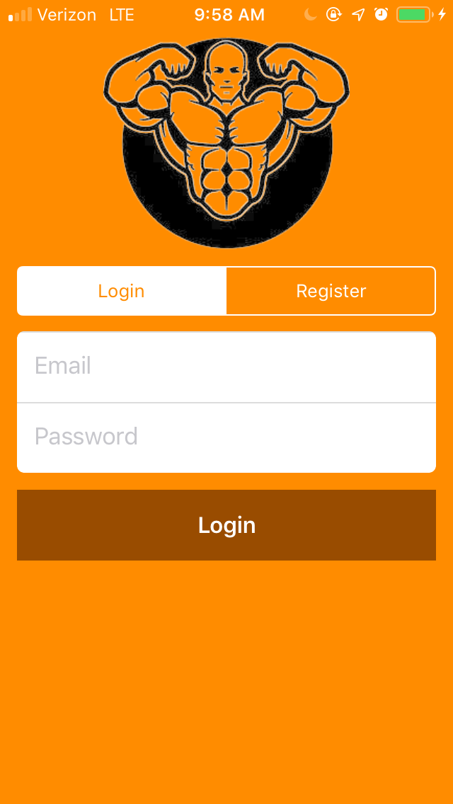
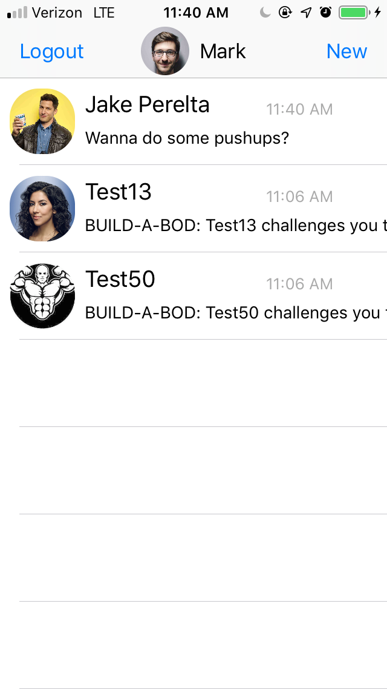
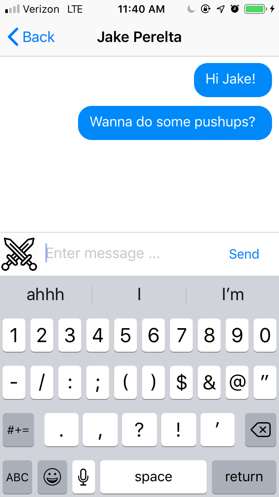
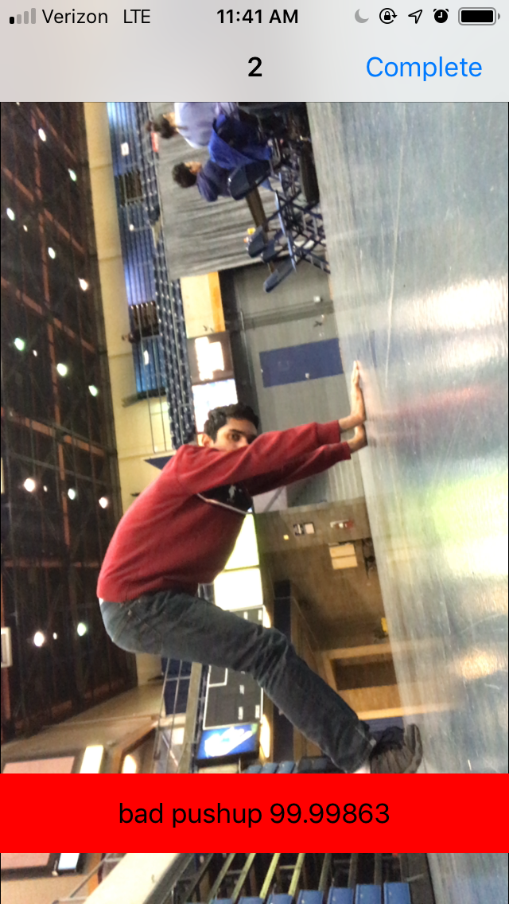
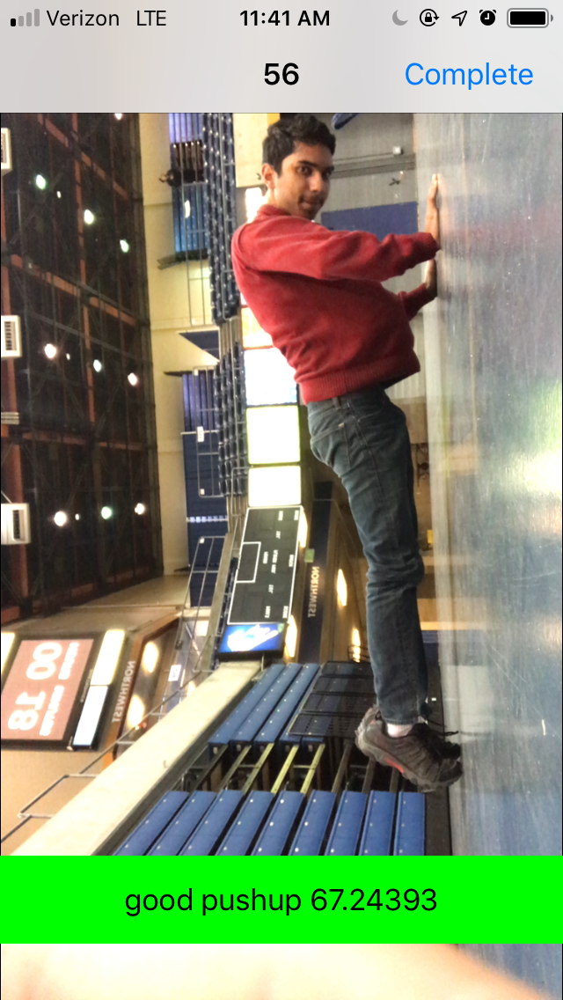

# Build-A-Bod #

Build-A-Bod is an iOS fitness app that promotes the wellbeing of users, encouraging to be more active through daily challenges, computer vision, and gamification. The original MVP repo is [here](https://github.com/adityaramkumar/Build-A-Bod "here"). This new repository was created so that we could add onto this project without ruining the integrity of what was originally created at HackDavis 2019. 

## Here's the whole story ##

For years, Umang, one of our team members, struggled with proper exercise form while going through physical therapy. The daily stretches themselves weren’t particularly hard for him--the difficult part came from doing them correctly. This inspired us to create an app that checks for proper form while performing exercises. We decided to broaden the app’s focus to target other audiences by making it fun to be active. Introducing Build-A-Bod!

Users can create an account and Firebase integration lets them message friends to introduce a social aspect to exercise. Users can also “challenge” others to exercise by recording themselves performing an exercise. Every repetition of an exercise--currently, push ups--is checked with our TensorFlow Machine Learning model to verify proper form. Good form will result in a green bar appearing, while bad form will result in a red bar. Users will accumulate FitCoins, aka score, proportional to how many repetitions they perform, and how well they were done. All together, the social networking aspect along with accumulating score encourages users to be more active and learn about how to properly exercise.

## Build Status ##

Right now, Build-A-Bod is at it's MVP level stage. While the end-to-end chat functionality through Firebase is fully functional, there are several improvements that we'd like to make to our machine learning model as it only supports one exercise, push ups. 

In the future, we plan to extend our app’s functionality to include a wide variety of other exercises, such as sit ups, planks, and jumping jacks. Alongside this, a feature we did not have enough time to implement was a daily feed of suggested exercises for each user to perform. 

## Screenshots ##

## Technology and frameworks used ##

**Built with**
  * Swift 4.0
  * XCode 10.1
  * CocoaPods
  * [Firebase](https://console.firebase.google.com/u/0/ "Google's Firebase")
  * [Core ML](https://developer.apple.com/documentation/coreml "Core ML")
  * [Tensor Flow](https://www.tensorflow.org/lite "Tensor Flow")
  * [Tensor Flow to Core ML Converter](https://github.com/tf-coreml/tf-coreml "TF-COREML")
  
## Installation ## 

1. Download the zip file in the repo labeled "Snapchat.zip".
2. Unzip the file, then open Chat1.xcodeproj on XCode.
3. Select which simulator you'd like to run the application on in the top left corner of XCode. 
4. Build and run simulator.

## How To Use ## 

1. When you open the app, you'll land on the login page. Switch to "Register" with the tab bar, and create an account with a name, email, and password. Tapping on the logo will also allow you to set a profile image. 
2. Tap on the "Register" button.
3. Start a new message to one of the pre-existing users or create a new user by logging out and registering another user. 
4. Send messages in the chat! The user on the other side will receive that message. 
5. Tap on the sword icon in order to challenge the user to a push-up duel. The app will open the camera and ask for your permission. After accepting, set the phone down by leaning it against some sort of sturdy object. Alternatively, if you have a Pop Socket (or a variation of it), open it up and rest the phone on its side. 
6. Move far enough away from the camera such that at least 90% of your body is in the camera frame. 
7. Get into pushup position and wait until the validation bar turns green. Once it does, then you're in proper form and can begin performing pushups. 
8. Once you're done, tap "Complete", you will receive Fitcoins and a message will be sent to the other user. 
9. Repeat and enjoy!

## Contribute ## 

The Build-A-Bod team is looking to integrate the Open Source Computer Vision Library into our project and would like further mentorship/guidance from machine learning and computer vision experts. If this is a project that possibly interests you, email me at micahtyong@gmail.com !

## Credits ## 

This is an original project idea by Micah Yong, Aditya Ramkumar, Maxwell Chan, and Umang Srivastav. 
